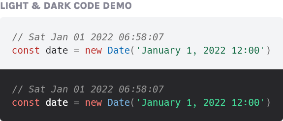

# Hack Dotted Zero
Hack Dotted Zero is the wonderful [Hack](https://github.com/source-foundry/Hack) font, with the filled zero replaced with a dotted zero.
I edited this for use on my [blog](https://www.ctnicholas.dev).

- Filled zero now a dotted zero
- All weights have been updated.
- `ttf`, `woff`, and `woff2` file types included.

MIT License. Modified version is Hack release as of *24th June 2021*. 
